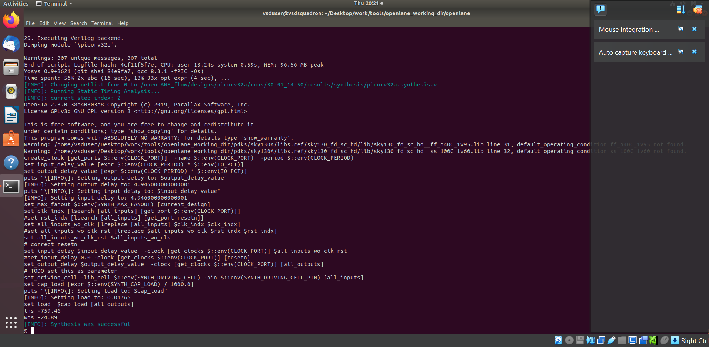

# VSD-IAT VLSI for High School Level 3
## Design Flow
<details>
<summary>Expand or collapse</summary>

### Understanding Embedded Boards and Chip Structure
- In embedded boards, what appears as the chip is actually its package, which acts as a protective layer.  
- The actual silicon chip is placed inside the package, typically at its center.  
- Wire bonding is used to connect the chip to the package, creating electrical pathways.  

### Internal Structure of a Chip  
- Pads facilitate communication between the chip and the external world.  
- The core is the central area within the pads, where digital logic is implemented.  
- The die consists of both the core and pads, serving as the fundamental unit in semiconductor manufacturing.  

### Semiconductor Manufacturing & Foundries  
- Foundries are facilities where semiconductor chips are fabricated.  
- Foundry IPs (Intellectual Properties) are specialized design elements created for a specific manufacturing process.  
- Macros refer to reusable digital logic blocks within a design.  

### Instruction Set Architecture (ISA) & Program Execution  
- A C program targeting specific hardware undergoes multiple processing stages.  
- It is first compiled into assembly language, aligning with a specific ISA (e.g., RISC-V).  
- Assembly code is then translated into machine code (binary format of 0s and 1s).  
- This machine code is executed by hardware following a standard RTL to GDSII flow.  

### Software-Hardware Interaction  
- System software translates application programs into binary instructions.  
- Key system software components include:  
  - Operating System (OS): Generates functional outputs in C, C++, Java, etc.  
  - Compiler: Converts these outputs into architecture-specific instructions.  
  - Assembler: Translates instructions into binary machine code.  
- The final binary code is processed by the hardware for execution.  

### Hardware Design & Implementation  
- Register Transfer Level (RTL): Describes hardware behavior using HDLs (e.g., Verilog, VHDL).  
- Synthesis: Converts RTL into a gate-level netlist composed of standard logic gates.  
- The netlist is fabricated into a physical chip through semiconductor manufacturing. 

### Open-Source ASIC Design & Evolution  
- Key enablers for open-source ASIC development:  
  - RTL designs (digital logic descriptions).  
  - EDA tools (Electronic Design Automation software).  
  - PDK data (Process Design Kits for fabrication).  
- Early IC manufacturing was restricted to a few companies (e.g., Intel, TI).  
- In 1979, Lynn Conway & Carver Mead introduced structured VLSI design, leading to the rise of:  
  - Fabless companies (design-only firms).  
  - Pure play fabs (fabrication-only firms).  
- Process Design Kits (PDKs) provide manufacturing specifications but were historically locked under NDAs.  
- In 2020, Google & SkyWater released the first open-source PDK for the 130nm process.  

### ASIC Design Flow  
- ASIC implementation requires multiple EDA tools and methodologies.  
- ASIC Flow: A software-driven approach integrating various tools to execute design steps.  

### OpenLANE ASIC Design Flow  
- Converts RTL code into GDSII format, required for chip fabrication.  
- Synthesis transforms RTL descriptions into circuits composed of Standard Cell Libraries (SCLs).  
- The result is a Gate-Level Netlist, functionally identical to the RTL.  

### Standard Cells & Their Views  
- Standard cells have regular layouts and multiple representations:  
  - Liberty view: Electrical properties.  
  - HDL model: Behavioral description.  
  - SPICE/CDL views: Circuit-level details.  
  - GDSII view: Detailed physical layout.  
  - LEF view: Abstract representation.  

### Chip & Macro Floor Planning  
- Chip floor planning defines component placement on the chip.  
- Macro floor planning arranges larger blocks (e.g., memory, logic units).  

### Power Planning  
- Uses upper metal layers for power distribution due to lower resistance.  
- Ensures electromigration & IR drop issues are minimized.  

### Placement Process  
- Global placement: Provides approximate locations for components.  
- Detailed placement: Refines positions to ensure legal (non-overlapping) placement.  

### Clock Tree Synthesis (CTS)  
- Distributes the clock signal across the design.  
- Minimizes clock skew (timing variations across the chip).  

### Finalization & Verification  
- Sign-Off Checks ensure design correctness before fabrication:  
  - DRC (Design Rule Checking): Verifies fabrication constraints.  
  - LVS (Layout vs Schematic): Confirms layout matches the netlist.  
  - STA (Static Timing Analysis): Ensures correct timing operation.
</details>

## Section 1

### 1. Initialise OpenLane Flow Docker and Perform Synthesis
```bash

    cd Desktop/work/tools/openlane_working_dir/openlane
    #Opens OpenLane folder

    docker
    #Activates Docker container for OpenLane

    pwd
    #Unlocks Docker container

```
    
```bash

    ./flow.tcl -interactive
    #Activates interactive mode in OpenLane

    package require openlane 0.9
    #Adds the required OpenLane package to run

    prep -design picorv32a
    #Prepares pre-installed picorv32a design and prepares it for synthesis

    run_synthesis
    #Runs the synthesis in interactive mode in OpenLane on pre-prepared design and returns design statistics on completion

    exit

    exit
    #Exits the OpenLane flow and the docker sub-container
```

&nbsp;
### Images of code running




&nbsp;

### 2. Completion of Task 1 (Finding of Flop Ratio)
&nbsp;
$$
    \text{Flop Ratio} = \frac{\text{Number of D Flip Flops}}{\text{Number of Cells}}
$$
$$
    \text{Flop Ratio Percentage} = \text{Flop Ratio} * 100
$$
### Image of synthesis results


### Calculation of Flop Ratio:
$$
    \text{Flop Ratio}=\frac{1613}{14876}=0.1084296853993009
$$
$$
    \text{Flop Ratio percentage}=0.1084296853993009*100=10.84296853993009\%
$$

----
&nbsp;

## Section 2

### Theory

<details>
<summary>Expand or collapse</summary>

### Calculating width and height of die and core
- Core and Die definitions
  - Core is the part of the die upon which the fundamental components of the chip are built
  - Die is the semiconductor wafer on which the cores are fabricated
- Minimum area of core is the sum of all the areas of the fundamental components (i.e. area of the netlist) and is unachievable due to the need for space for wires, buffers etc.
- Utilisation factor
  - Quantifies the space efficiency of the floor plan of the chip
  - $\text{Utilisation factor}=\frac{\text{Area of the netlist}}{\text{Total area of the core}}$
- Aspect Ratio
  - Height to width ratio of the core
  - $\text{Aspect Ratio}=\frac{\text{Height}}{\text{Width}}$

### Pre-placed cells and concept of modules
- Module
  - Part of the chip's combinational logic with its own inputs and outputs
  - Modular and can be repeatedly instantiated using a preset
- Pre-placed cells
  - These modules are manually placed on the chip layout before automated planning and routing.
  - Placed during floorplanning
  - Good placement is essential as the automated routing and planning algorithm has to work around and not interfere with these modules.

### Need for decoupling capacitors
- Output voltages are characterised into 0 and 1 with a section of noise between them.
- Due to the resistance offered by the physical wires and the distance between the power supply and the components, a voltage drop can be seen.
- If the voltage drop is so major that the input voltage itself is within the noise band, uncertain and incorrect results may be seen.
- Hence, to reduce the effect of these voltage drops, a decoupling capacitor can be connected in a parallel connection with the module:
  - When there is a demand for voltage, the charge is taken from the capacitor not from the power supply directly
  - The power supply is itself connected to the capacitor and ensures that it is charged up to an accpetable voltage
  - This acts like a buffer ensuring that the voltage drops and noise in the circuit voltage don't affect the components' outputs
  - The close physical proximity to the components themselves helps reduce the further voltage drop due to resistance

### Power planning
- When communication between modules is over a large distance, signal loss due to resistance is likely and cannot be alleviated through a decoupling capacitor as its unfeasible to place decoupling capacitors on every connection on the chip.
- Ground Bounce and Voltage Droop
  - Ground Bounce
    - After the inversion logic, a large number of charged capacitors in a bus drain their charge (change state from 1 to 0) simulataneously into the same ground line.
    - This leads to a sudden increase in the voltage of the ground and can cause inaccuracies if the voltage enters the noise band.
    - This increase however, is temporary and returns to normal soon after. 
  - Voltage Droop
    - After the inversion logic, a large number of uncharged capacitors in a bus take up charge simultaneously from the same power line.
    - This leads to a sudden drop in the power voltage and can cause inaccuracies if it falls enough to enter the noise band.
    - This decrease, however is temporary and returns to normal soon after.
  - Cause - Singular power supply and ground leading to overstress of the voltage supply
  - Solution 
    - Decentralised, independent power supplies that form a grid-like 'mesh' across the chip 
    - Ensures that power need not pass through only one supply but can be taken from the nearest power supply reducing stress on one supply

### Pin placement
- Input and output pins are placed on the edge of the die and can be positioned or whichever side is most convenient to the design or designer
- The pre-placed cells on the chip need to be placed strategically near the appropriate input/output pins to which they are most closely connected.
- The input and output pins must also be thoughtfully placed to ensure that any flip-flops or components do not interfere with the pre-placed cells on the chip.
- The clock ports must also be given special consideration as they are thicker than the data inputs and outputs due to the necessity of the least resistance for the clock signal.
- The die edge must be blocked for logical cell placement for the automated routing tool as it is reserved for pins.
</details>